# Entity Relationship Diagram (ERD) for Websmith Kit

This document outlines the relationships between key entities, data structures, and components in the Websmith Kit codebase.

## Package Dependencies

```mermaid
graph TD
    A[websmith-kit (root)] --> B[websmith-ui]
    A --> C[websmith-tokens]
    A --> D[websmith-theme]
    A --> E[websmith-cli]
    A --> F[websmith-governance]
    A --> G[websmith-figma]
    A --> H[websmith-a11y]
    A --> I[websmith-eslint]
    A --> J[websmith-vscode]
    A --> K[apps/docs]
    A --> L[apps/playground]

    B --> M[Radix UI]
    B --> N[Tailwind CSS]
    B --> O[class-variance-authority]
    B --> H

    E --> P[commander]

    F --> B
    F --> C

    K --> B
    K --> C
    K --> D
    K --> F
    K --> H

    L --> B
    L --> C
    L --> D
```

## Data Flow Architecture

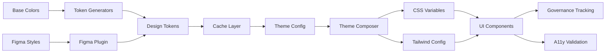

## Component Hierarchy

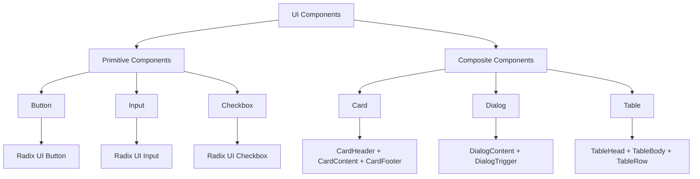

## Token System Structure

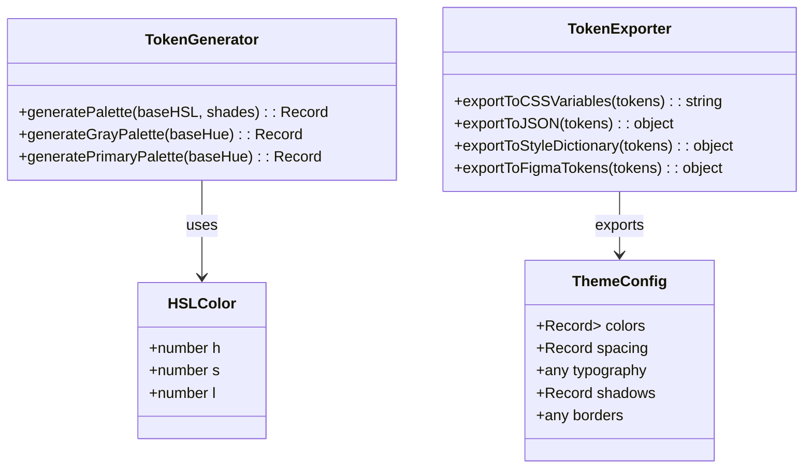

## CLI Command Structure

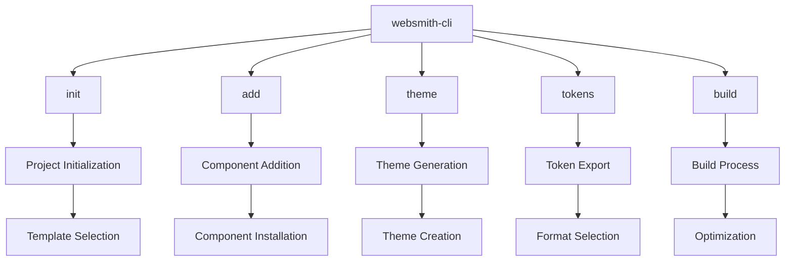

## Theme System Relationships

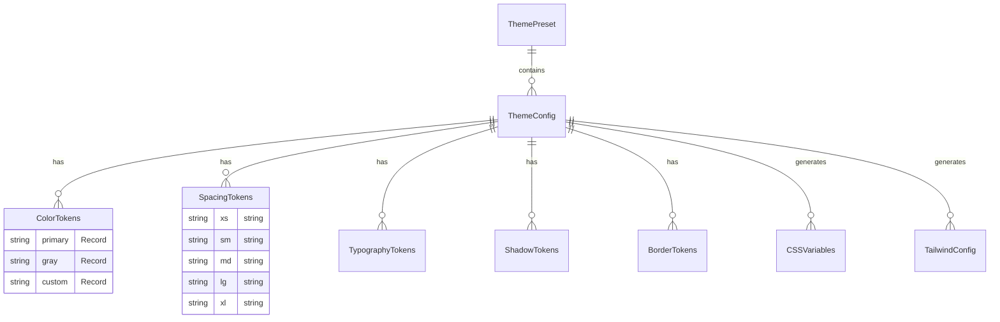

## Component Dependencies

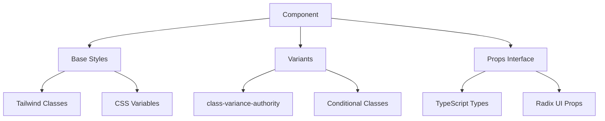

## Build and Deployment Flow

````mermaid
flowchart LR
    A[Source Code] --> B[TypeScript Compilation]
    B --> C[ESLint Check]
    C --> D[Prettier Format]
    D --> E[Bundle Generation]
    E --> F[NPM Publish]
    F --> G[CDN Distribution]

    B --> H[Type Checking]
    H --> I[Turbo Cache]
    I --> E

    E --> J[Docker Build]
    J --> K[Vercel Deploy]
    K --> L[Documentation Site]
```

## Theme Composition System

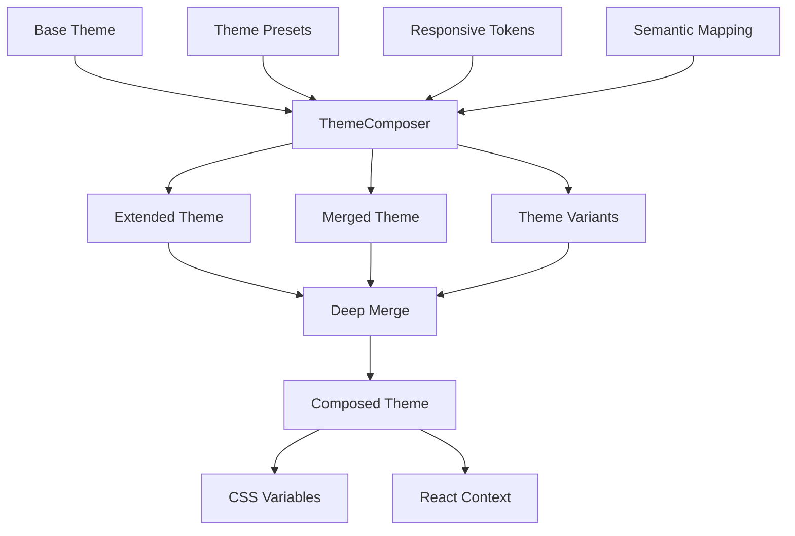

## Governance System Architecture

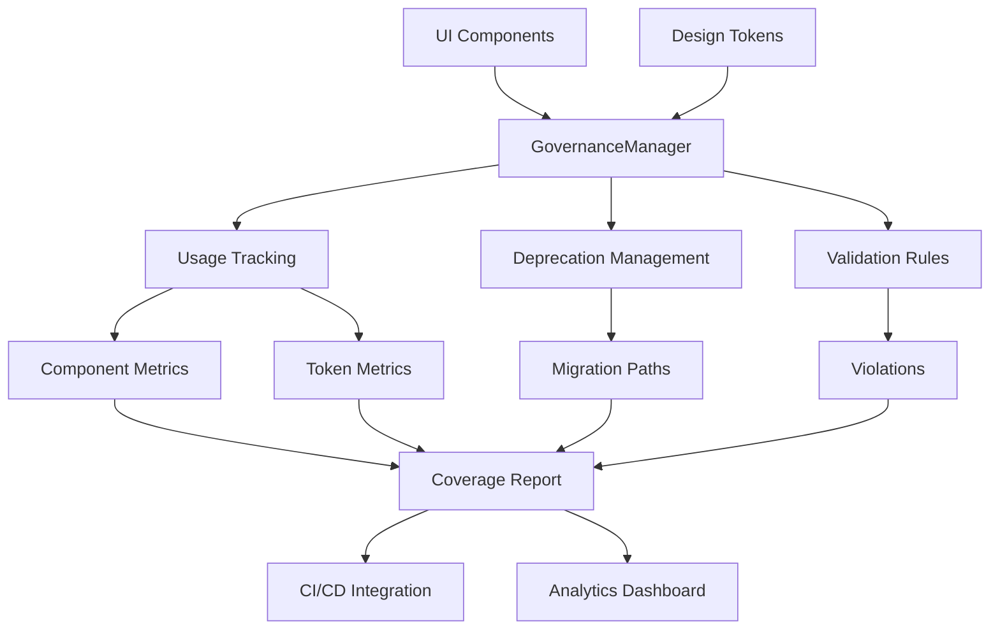

## Accessibility Validation Flow

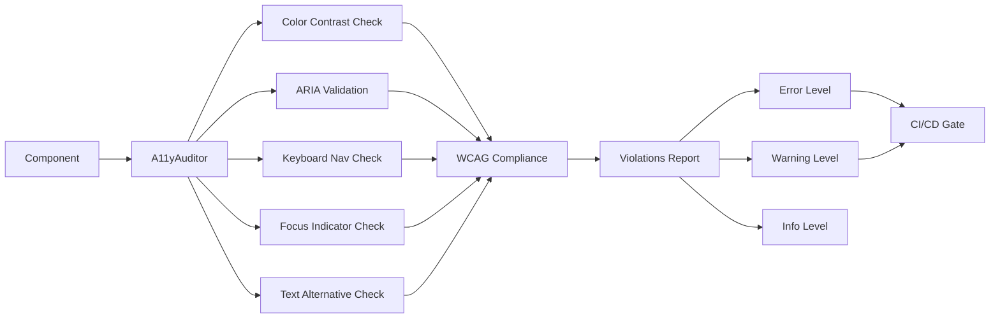

## Internationalization System

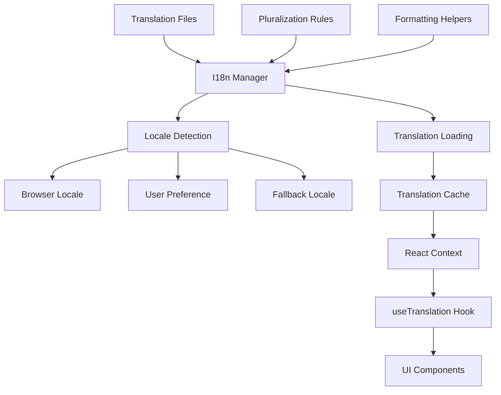

## Figma Integration Flow

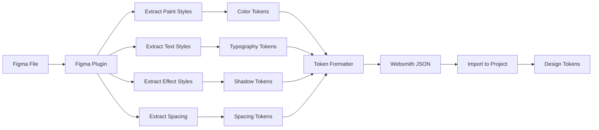

## Performance Optimization Architecture

```mermaid
graph TD
    A[Token Generation] --> B[Cache Check]
    B -->|Hit| C[Return Cached]
    B -->|Miss| D[Generate New]
    
    D --> E[Batch Processing]
    E --> F[Deduplication]
    F --> G[Minification]
    
    G --> H[Store in Cache]
    H --> C
    
    I[CSS Generation] --> J[Optimization]
    J --> K[80-85% Faster]
    
    L[Component Loading] --> M[Code Splitting]
    M --> N[Lazy Loading]
    N --> O[Tree Shaking]
    O --> P[Minimal Bundle]
```</content>
<parameter name="filePath">ERD.md
````
