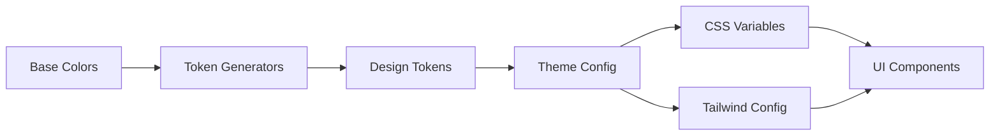
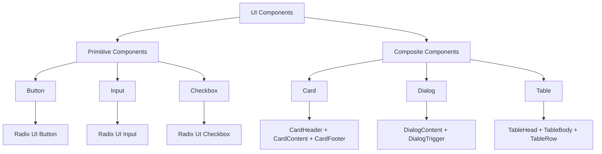
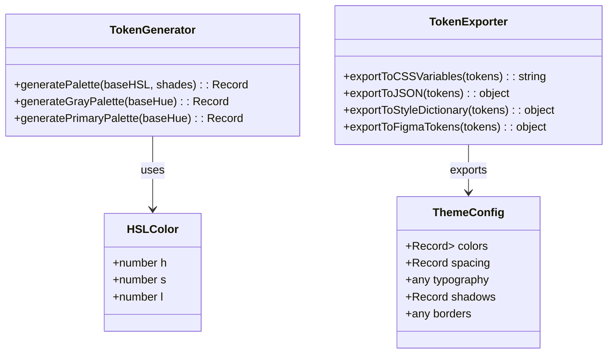
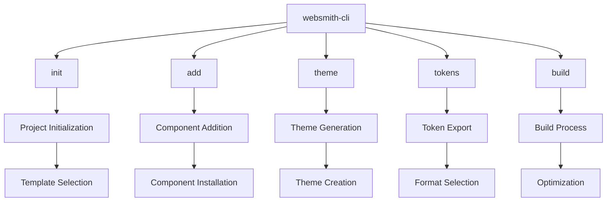
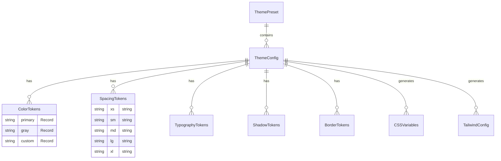
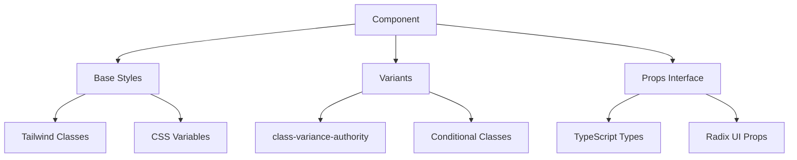

# Entity Relationship Diagram (ERD) for Websmith Kit

This document outlines the relationships between key entities, data structures, and components in the Websmith Kit codebase.

## Package Dependencies

```mermaid
graph TD
    A[websmith-kit (root)] --> B[websmith-ui]
    A --> C[websmith-tokens]
    A --> D[websmith-theme]
    A --> E[websmith-cli]
    A --> F[apps/docs]
    A --> G[apps/playground]

    B --> H[Radix UI]
    B --> I[Tailwind CSS]
    B --> J[class-variance-authority]

    E --> K[commander]

    F --> B
    F --> C
    F --> D

    G --> B
    G --> C
    G --> D
```

## Data Flow Architecture



## Component Hierarchy



## Token System Structure



## CLI Command Structure



## Theme System Relationships



## Component Dependencies



## Build and Deployment Flow

````mermaid
flowchart LR
    A[Source Code] --> B[TypeScript Compilation]
    B --> C[ESLint Check]
    C --> D[Prettier Format]
    D --> E[Bundle Generation]
    E --> F[NPM Publish]
    F --> G[CDN Distribution]

    B --> H[Type Checking]
    H --> I[Turbo Cache]
    I --> E

    E --> J[Docker Build]
    J --> K[Vercel Deploy]
    K --> L[Documentation Site]
```</content>
<parameter name="filePath">ERD.md
````
